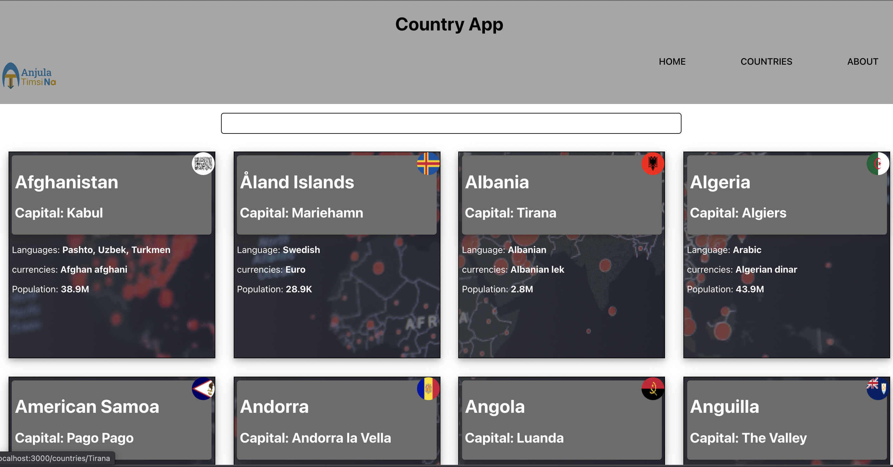

# Countries_data

## Introduction

This is the react app where axios is used to do http request for getting data from countries api.

## Screenshot

## Sources

- [axios documentation](https://axios-http.com/docs/intro)
  src/images/screnshot.png
